# 👋 Olá, eu sou Renan Vasconcelos

> *"Não é livre aquele que não obteve domínio próprio.Pitágoras"* — Pitágoras

---

## 🚀 Sobre mim

🎓 **Formação:**

* Graduação Analise e Desenvolvimento de Sistema — Uninassau
* Pós-Graduação de Segurança e Defesa Cibernética — Uninter
* Técnico de Informática — Senac 

💼 **Atuação:**

* Freelance
---

  

## 💻 Tecnologias

### Linguagens

### Banco de Dados

### Ferramentas

---

## 📚 Atualmente estudando

* 📖 Docker
* 📖 Nginx
* 📖 Nextcloud

---

## 📂 Projetos em destaque

### 🔹 Ecoobytes

**Descrição:**
O **EcooBytes** é um sistema web desenvolvido para uma cooperativa de reciclagem eletrônica e inclusão digital, com o objetivo de conectar doadores de equipamentos, usuários que necessitam de assistência técnica e promover a conscientização sobre sustentabilidade por meio de um simulador de impacto ambiental.

A plataforma foi desenvolvida utilizando **HTML, CSS, JavaScript, PHP e MySQL**, oferecendo uma interface intuitiva, formulários seguros para doações e solicitações de assistência técnica, além de persistência dos dados em banco de dados.

Este projeto foi desenvolvido como parte de um **Projeto Integrador** e **já foi apresentado à banca avaliadora**, recebendo reconhecimento pelo seu potencial de impacto social e ambiental. Como resultado, foi **recomendado para uma incubadora de ideias**, destacando-se pela proposta de economia circular, inclusão digital e reaproveitamento de equipamentos eletrônicos.

**Tecnologias:**

* HTML
* CSS
* PHP
* MySQL

**Status:** ✅ Concluído

---

### 🔹 Bitssenger

**Descrição:**
Breve descrição do projeto.

**Tecnologias:**

* ...

**Status:** 🚧 Em Planejamento

---

## 📊 Estatísticas do GitHub

---

## 🔥 Sequência de contribuições

---

## 🏆 Conquistas

---

## 📈 Atividade

---

## 🌐 Contato

* 📧 Email: **renanvasconcelos116@protonmail.com**
* 💼 LinkedIn: www.linkedin.com/in/renan-amaral-45719397
* 🌎 Portfólio: https://seusite.com
* 🐙 GitHub: https://github.com/renanvascz

---

## 🎯 Objetivos

* Contribuir para projetos Open Source.
* Evoluir como desenvolvedor.
* Aprender novas tecnologias.
* Compartilhar conhecimento.

---

## 💡 Curiosidades

* 🚴 Atividade Físicas
* 🎮 Jogos de Corridas
* 📚 Livros Reflexivos
* 🏎️ Apaixonado por corrida 

---

### Obrigado por visitar meu perfil! 😄

